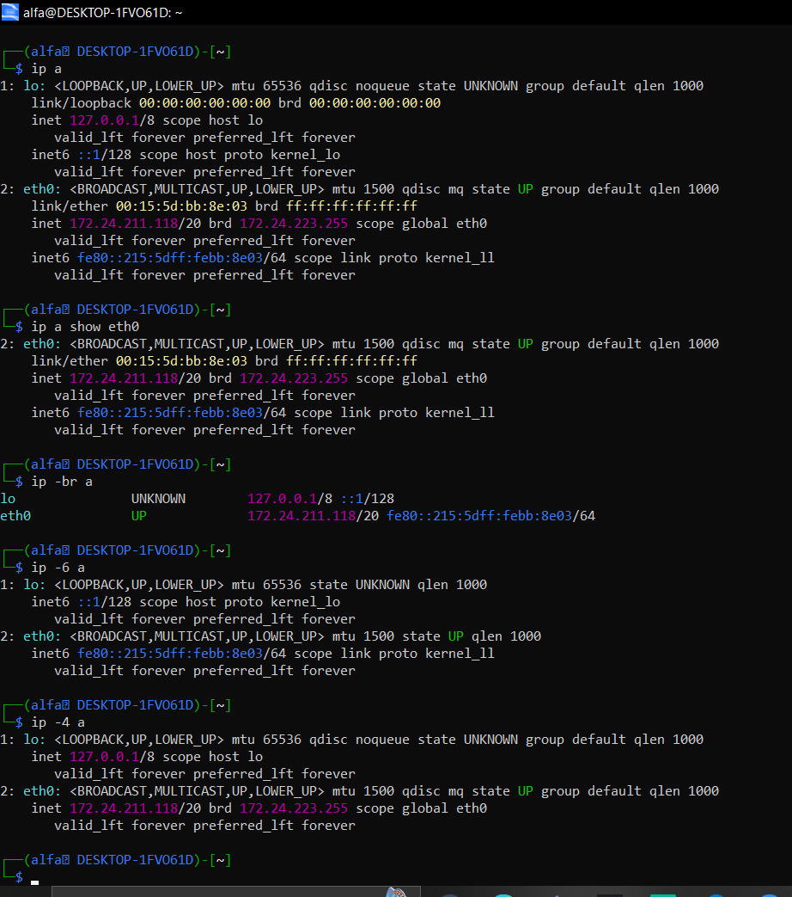
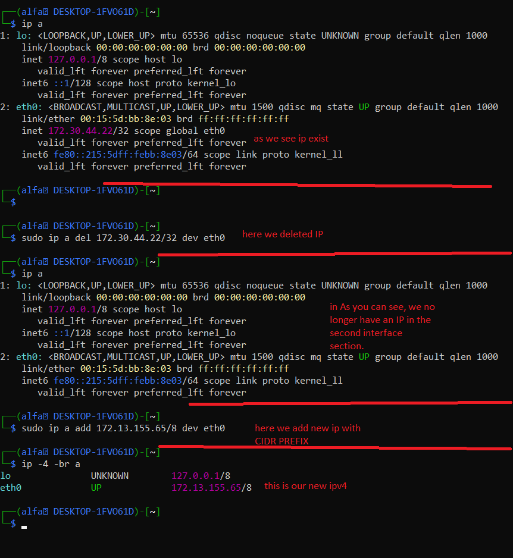

# ip addr command
---
# section 01-01 ip addr command
# بخش 01-01 دستور ip addr
---
# ا<mark>مقدمه ای از دستور ip addr</mark>
# دستور `ip addr`

دستور `ip addr` برای نمایش و مدیریت **کارت‌های شبکه (Network Interfaces)** و **آدرس‌های IP** در Linux استفاده می‌شود:
- نمایش --->اینترفیس ها و کارت هایه شبکه
- نمایش ادرس--->ipv4 & ipv6

این دستور یکی از زیر‌دستورهای ابزار `ip` است و جایگزین مدرن بخش بزرگی از کاربردهای دستور قدیمی `ifconfig` محسوب می‌شود.

---
# با دستور ip addr  شما چه چیزهایی رو میتونید ببینید:
معمولاً این موارد را می‌بینی:
- ip addr
- انام کارت شبکه، مثل `ens33`، `eth0`، `wlan0`
- اوضعیت کارت شبکه، مثل `UP` یا `DOWN`
- اMAC Address
- اIPv4 Address
- اIPv6 Address
- اBroadcast Address
- اCIDR Prefix مثل `/24`
- انوع IP؛ مثلاً `dynamic` برای IP گرفته‌شده از DHCP
---
# ا<mark>قسمت توضیحات دستور ip addr</mark>
- نمونه ای از خروجی دستور ip addr
```
2: ens33: <BROADCAST,MULTICAST,UP,LOWER_UP> mtu 1500 state UP
link/ether 00:0c:29:12:34:56 brd ff:ff:ff:ff:ff:ff
inet 192.168.1.50/24 brd 192.168.1.255 scope global dynamic ens33
inet6 fe80::20c:29ff:fe12:3456/64 scope link
```
- قسمت اول شماره دارد : شماره اون رابط رو نشون میده
- قسمت دوم <mark>ens33 & lo & etho</mark>.. : این قسمت اسمه رابط رو نشون میدهد
- قسمت سوم : <mark>UP & DOWN</mark> نشون میده که رابط توسط سیستم فعاله
- قسمت چهارم : <mark>LOWER_UP</mark> میگه اتصاله فیزیکی یا مجازی برقراره
- قسمت پنجم : <mark>link/ether </mark>--->نشون دهنده ی مک ادرس اون رابط است اون شیش تا خونه ای که با colon (:)از هم جدا شدند رو منظورمه 00:0c:29:12:34:56
- قسمت ششم :<MARK> inet </MARK>نشون دهنده ی  IPV4 است همون ادرسی که 4 تا اکتت پشت هم یا 32 بیت است
192.168.1.50/24 + اون 24/ نشان دهنده ای CIDR prefix length است که درموردش درست کردم [prefix length](../02-Services-Protocols/04-Subnetmask-Prefixlength.md)
- قسمت هفتم :<MARK>brd 192.168.1.255</MARK> این قسمت نشان دهند هی Broadcast address است
- قسمت هشت : <MARK>scope global</MARK> میگه که این IP فقط مخصوص سیستم نیست و میتواند برایه ارتباط در شبکه استفاده شود
- قسمت نهم: <MARK>inet6</mark> نشون دهنده ی  IPV6 Address است
- قسمت دهم : <mark>scope link</mark> این میگه inet6 & IPV6 فقط در شبکه ی محلی معتبر است

---
+
# ا<mark>بریم سراغ مدل هایه مختلف دستور ip addr </mark>
- 1- حال عادی دستور  ip addr or (ip a) رو بالا برسی کردیم


- 2-حالت دوم شما میتونید دو مدل با address  ها با دستور  ip کارکنید:
```
ip addr == ip a 

---
output--->
---

1: lo: <LOOPBACK,UP,LOWER_UP> mtu 65536 qdisc noqueue state UNKNOWN group default qlen 1000
    link/loopback 00:00:00:00:00:00 brd 00:00:00:00:00:00
    inet 127.0.0.1/8 scope host lo
       valid_lft forever preferred_lft forever
    inet6 ::1/128 scope host proto kernel_lo
       valid_lft forever preferred_lft forever
2: eth0: <BROADCAST,MULTICAST,UP,LOWER_UP> mtu 1500 qdisc mq state UP group default qlen 1000
    link/ether 00:15:5d:bb:8e:f7 brd ff:ff:ff:ff:ff:ff
    inet 172.24.211.118/20 brd 172.24.223.255 scope global eth0
       valid_lft forever preferred_lft forever
    inet6 fe80::215:5dff:febb:8ef7/64 scope link proto kernel_ll
       valid_lft forever preferred_lft forever
میتونید از مدل خلاصه شده  دستور استفاده کنید
```


- 3-حالت سوم : اگر بخواهید به صورت خاص فقط یک رابط رو ببنید به صورت این صورت عمل میکنید
```
ip addr show interfacename(eth0,lo,ens00,....)
for example---->
1-ip addr show eth0
2-ip a show eth0
---
output--->
---

2: eth0: <BROADCAST,MULTICAST,UP,LOWER_UP> mtu 1500 qdisc mq state UP group default qlen 1000
    link/ether 00:15:5d:bb:8e:f7 brd ff:ff:ff:ff:ff:ff
    inet 172.24.211.118/20 brd 172.24.223.255 scope global eth0
       valid_lft forever preferred_lft forever
    inet6 fe80::215:5dff:febb:8ef7/64 scope link proto kernel_ll
       valid_lft forever preferred_lft forever
```


- 4-حالت چهارم: دیدن رابط ها & وضعیت اون رابط & دیدن inet +CIDR PREFIX + inet6 به صورت خلاصه
```
with ---> -br ->accronym of brief(این گزینه به معنایه کوتاه شده است)
ip -br a & ip -br addr
---
output--->
---

lo               UNKNOWN        127.0.0.1/8 ::1/128
eth0             UP             172.24.211.118/20 fe80::215:5dff:febb:8ef7/64
```


- 5-حالت پنجم: دیدن دقیقا همون ip addr حالت عادی با فقط IPV4 و IPV6 
```
for IPV6
ip -6 a & ip -6 addr
for IPV4
ip -4 a & ip -4 addr
---
output--->
---
for IPV4--->(inet رو فقط نشون میده)


1: lo: <LOOPBACK,UP,LOWER_UP> mtu 65536 qdisc noqueue state UNKNOWN group default qlen 1000
    inet 127.0.0.1/8 scope host lo
       valid_lft forever preferred_lft forever
2: eth0: <BROADCAST,MULTICAST,UP,LOWER_UP> mtu 1500 qdisc mq state UP group default qlen 1000
    inet 172.24.211.118/20 brd 172.24.223.255 scope global eth0
       valid_lft forever preferred_lft forever
       
---     
for IPV6--->(inet6 رو فقط نشون میده)


1: lo: <LOOPBACK,UP,LOWER_UP> mtu 65536 state UNKNOWN qlen 1000
    inet6 ::1/128 scope host proto kernel_lo
       valid_lft forever preferred_lft forever
2: eth0: <BROADCAST,MULTICAST,UP,LOWER_UP> mtu 1500 state UP qlen 1000
    inet6 fe80::215:5dff:febb:8ef7/64 scope link proto kernel_ll
       valid_lft forever preferred_lft forever
```
<p align="center">
	
</p>

---

---
- 6-حالت ششم: حذف IP و اضافه کردن IP
- نکته: دستور `ip addr add` معمولاً IP جدید را **به IPهای قبلی اضافه می‌کند**؛ جایگزین‌کردن کامل IP نیاز به حذف IP قدیمی یا تنظیم دائمی با Netplan / NetworkManager دارد.
```
new model with ip command
for add IP--->sudo ip (a&addr) newIP4/prefix dev interfacename
for del IP--->sudo ip (a&addr) del currentlyip dev interfacename
---
old model with ifconfig command
sudo ifconfig ens33 192.168.1.10 netmask 255.255.255.0 up

```
<p align="center">
	
</p>


مراحل عوض کردن IPV4
- 1 -->دیدن IPV4 رابط فعلی --> ip -br -4 a & ip -br -4 addr
- 2-->پاک کردن IPV4 قبلی---> ip a del  currentip/cidrprefix dev interfacename
- 3-->بعد پاک کردن IPV4 دیگر اگر ip a بزنیم inet نداریم
- 4-->حالا بریم سر وقت  اضافه کردن ای پی-->ip a add newip/prefix dev interface
- 5-->حالا اگر -->ip -br -4 a --->میبینی ip جدید و CIDR Prefix جدید اضافه شده

---
